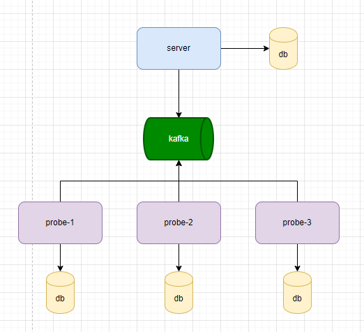

# P-dispatch 任务派发工具
### 背景
在很多业务场景中，存在一种业务场景就是有很多资源如果选择的问题。业界比较有名的就是kubernetes 也处理同样的业务场景， 比如一个k8s集群环境中，如果客户端发来一个创建pod的请求， 这时候k8s 的 schedule 组件就发挥了作用，schedule组件会根据客户端发送来请求资源情况，再从 k8s的api-server组件中获取集群各个节点的信息（信息包括 cpu， memory, disk 等信息）， 来从中选举出一个可以用来创建资源的节点，然后把这个计算出来的结果返回给 api-server，api-server得到结果后，会创建资源的任务和节点绑定，节点拿到这个绑定的信息后就执行这个创建资源的任务。

`P-dispatch ` 其实和 kubernetes 的 schedule 组件的原理是一样的，也是在集群环境中 一个server 带着多个 probe。server 负责接收客户端的请求，然后 把请求转化成为一个一个的task，然后分发给probe，其实probe就是具体的任务的执行者，这时候问题就来了，server到底让哪一个probe去执行任务，这里把任务派发的过程叫做 dispatch。

### P-dispatch 架构图

### 业务流

`1. ` probe 会启动一个quartz job, 获取probe所在机器信息（cpu，memory,jvm,os 等信息）还有 当前probe 任务队列的信息，把这些信息同步到kafka中。
`2. ` server 会去 监听kafka中 probe 同步过来的信息，让后把这些信息存到db。
`3. ` 当客户端发送一个执行task的请求到server，server会根据存储 probe的信息来计算出一个最优的节点，然后把最优的节点信息和task信息一起同步kafka中。
`4. ` probe 监听到了task的信息，然后判断这次的task是否是属于自己需要执行的，如果是就执行，如果不是执行忽略。
